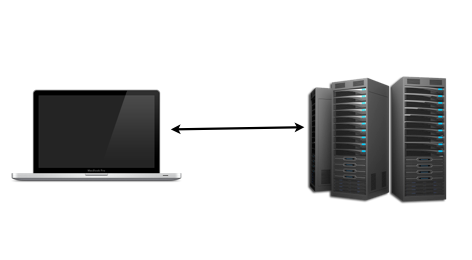
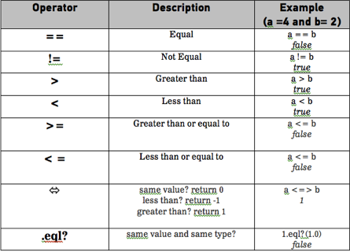
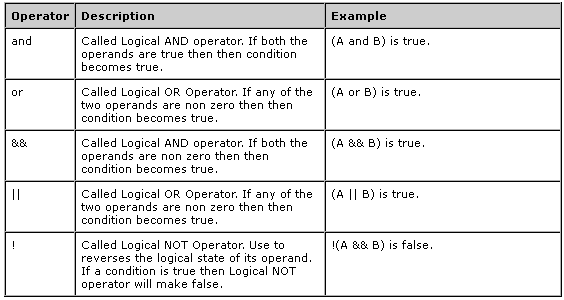

###Day 1: Introduction to Ruby, GitHub, and the Command Line

**Agenda:**

- Intro and Welcome: 10 min
- Check [installations](./install_instructions.md): 20 min 
- Review how to navigate file structure in the command line: 15 min
- Explain the request/response cycle: 15 min 
- Explain/Demo Basics of Ruby OO: 3 hours
	- Variables
	- Conditionals
	- Loops
	- Collections
	- Methods
	- Classes
	- Objects 

**Resources:**

- [coa_instr_boolean.rb](./ruby_basics/coa_instr_boolean.rb)
- [coa_instr_teddit_strings](./ruby_basics/coa_instr_teddit_strings)
- [resources.md](resources.md)  <-- cheat sheet to distribute to students

______

##Check Installations:

Find out if all students have git, Ruby, and Rails [installed](./install_instructions.md). If not, walk them through how to do it and spend some time troubleshooting with them. This might take some time so just a heads up.

---
##Command Line

###Time: 15 min

| | |
| ------------- |:-------------|
| __Topics__ | bash commands, terminal| 
| __Description__| Demonstrate how to navigate computer files and folders  using the terminal.|    
 

####Task Instructions 
1. Show students what the Terminal is
2. Create a directory named RailsWorkshop (mkdir)
3. Change into this folder (cd RailsWorkshop)
4. Create a file named hello.txt, complete, with the contents "hello world" (touch hello.txt)
5. Change to your home directory (cd)
6. Show the contents of the completed file to the terminal (cat)
7. cp the file (cp)
8. rename the file (mv)

**Instructional Notes:**

-	Make sure to explain each command while students follow along.
-	Switch back to finder every so often so students can make the connection to what they are familiar with.

---

## Internet & Request/Response Cycle
###Time: 15 min

###The Internet and your browswer
- What happens when you hit enter on your browser address bar?

---

###The request/response cycle

*	HTTP (the protocol that drives the Web) communicates via input/output just like the terminal.

*	Browsers send input (the request) and the server returns output (the response).

---

##Ruby & Rails

###Ruby

*	An open source programming language
*	Created by Yukihiro Matsumoto (aka Matz)
*	Natural to read and easy to write

###Ruby on Rails

*	Open source web application framework that runs on Ruby
*	Allows you to create web applications that query a database.

---

###Ruby first.

*	It will be easier to navigate a Rails project once we have a basic understanding of Ruby.

---

###Ruby Keywords

*	The vocabulary you will need to "_speak_" Ruby: 

ENCODING break case ensure false or redo undef unless FILE LINE class 
def loop for if rescue retry until when BEGIN END alias and begin
defined? do else elsif end in module next nil not return self super then true while yield

###That's It!

---

##IRB
Explain what IRB is why useful.

###Ruby Arithmetic Operators
Demo the basic arithmetic operators in IRB

##Programming Fundamentals

---

##Variables
###Store Values

		name = "Steven"
		=> name # "Steven"
		age = 2013 - 1983
		=> age # 30
---

##Data Types

		1.class 					#Fixnum
		1.99.class					#Float
		'Hi! String here!'.class 	#String
		"I'm a string tool".class	#String

---

##Teddit - Strings

Teddit is a news aggregator we will build during this course.

---

##Variables
### Getting Info From Users

		puts "Can you help me with these groceries?"
		response = gets
		=> program waits for you to type your response
		
---

##Data Types
###Booleans 

It's either TRUE or FALSE

---

##Boolean
###Logic Operators

---

##Booleans

---

##Variables & Data Types
###Recap 

Data Types

*	Number
*	Float
*	String
*	Booleans

Variables

*	Store values 
*	Values can change
*	Can be passed to methods.

---

##Methods

---

##Methods
###Keep your code DRY

* 	Groups program logic together so you don't have to repeat yourself. 
* 	Can pass variables to methods

		
		def say_hello_to(name)
			puts "Hi #{name}"
		end
		
		say_hello_to "John" 
		
	>	outputs: Hi John

----

##Conditional Logic
###Decision Time 

It's either TRUE or FALSE (like booleans)

If you are greater than 18 
you are an adult

	if age > 18
		puts "You are an adult"
	end

---

##Conditional Logic
###Multiple Conditions

	guess = 7 
	if guess > 5
		puts "Too high!"
	elseif guess < 5
		puts "Too Low!"
	else
		puts "You've guessed my hidden digit!"
	end

---

##Conditional Logic
###Multiple Conditions

---

